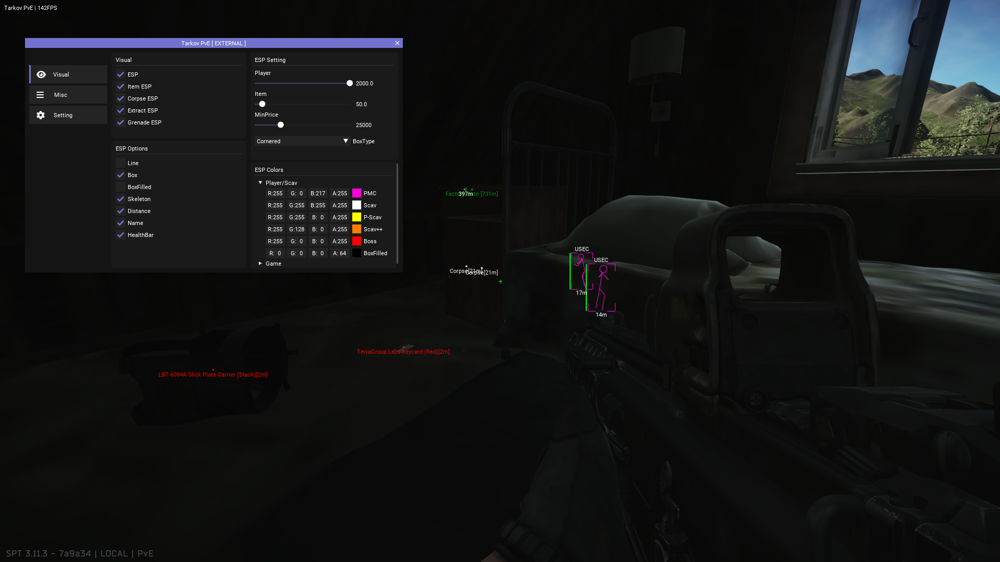

## 概要
SPT-AKI 3.11.3 向けの外部チートです。チート開発に対する興味を失ったので公開しておきます。  
モダンなGUIメニューやビジュアルを兼ね備えています。研究、分析、学習や調査用にもどうぞ。

## 機能
* Player ESP
* Exfil ESP
* Item ESP
* Grenade ESP
* Inf.Stamina, NoFallDamage, NoRecoil/Sway(not work)
* MenuKey : INSERT

## 備考
* CPU使用率が非常に高いです。全体的な改善が必要ですがめんどくさいです。
* ヒントとしては、「マルチスレッド化」「R/WPMの削減」「不必要な機能の削減」「コード/ロジックの最適化」が挙げられます。

## 実行
必要なライブラリは全て揃っているので、VisualStudioでビルドすれば普通に動くはずです。  
https://learn.microsoft.com/ja-jp/cpp/build/vscpp-step-0-installation?view=msvc-170

## 免責事項
このプロジェクトは学習や研究・教育用としてアップロードされました。  
これらの用途以外で使用した場合に発生した如何なる損害についても、製作者(Neko64V)は一切の責任を負いません。  

## 使用したライブラリ
* Microsoft DirectXTK (SimpleMath)  
https://github.com/microsoft/DirectXTK  
* ImGui  
https://github.com/ocornut/imgui  

## スクリーンショット
